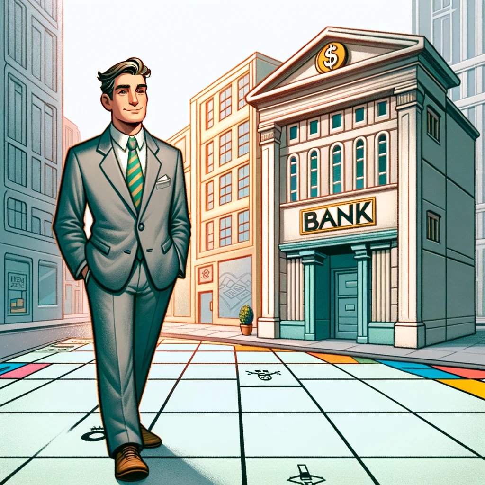

# Realistic Monopoly Simulator

Project description här: 

Ett bank/monopol spel.

Förlora genom att bli pank, dö av gammal ålder, mördad av maffian.

Ska kunna spola fram tid för att simulera inkomster och utgifter.

Tänker att man har olika symboler som man ska kunna interagera med för att använda funktioner som att stoppa in pengar, göra investering osv...

# Features
Kunna göra investeringar i form av att köpa fastigheter, handla med aktier och annat. Det ska gå att göra bra och dåliga investeringar.

Aktiedata för ett fåtal aktier i realtid? Ex Apple, Amazon, Tesla?

Spela Casino 

Kunna sätta in / ta ut pengar ur kontot

Kunna ta lån? Inkludera ränta och att man behöver betala tillbaka lånet

Kunna gå fram 1 månad eller 1 år i taget.

# How to use
Spelets/simulatorns startsida kommer bestå av fyra huvudkategorier; "Bank", "Real Estate Market", "Casino" och "Home". Varje kategoti kommer representeras med en undertext och en visuellt tilltalande bild som är relevant för respektive tema. 

Användare kan navigera genom spelet genom att välja en av dessa kategorier. Genom att klicka på någon av bilderna kommer användaren till en ny sida med nya specifika alternativ. Till exempel om användaren väljer att klicka på "Bank" kommer den den att komma till en ny sida med nya alternativ som "Deposit/Withdraw", "Buy/Sell Stocks" osv. Även dessa alternaiv kommer illustreras med en undertext och passande bilder. 
För att gå tillbaka en sida kommer vi ha en hemknapp.

# How to win/lose
vinner genom att nå en viss summa beroende på svårighetsgrad. 
Ju högre svårighetsgrad ju högre summa måste uppnås.

Förlorar genom att bli pank eller spolat fram tid tills man dlr
